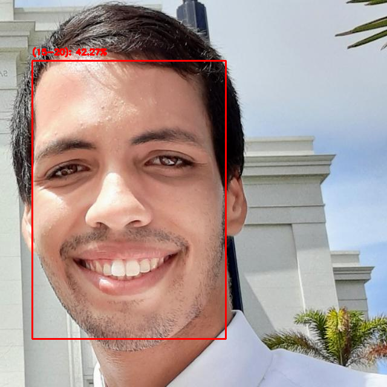

# Age Detection

Interested on a project from [Adrian Rosebrock](https://www.pyimagesearch.com/2020/04/13/opencv-age-detection-with-deep-learning/) on Age Detection I decided to dive in this challenge and find a good implementation of it! 

In his post, Adrian uses a pre-trained caffe model to make the predictions, which wasn't so good as I thought it would be, further steps will use my own net implementation and maybe sobre transfer learn! Let's find out together as this project goes on.

## A tasting of it

This was an test of the pre-trained caffe implementation! It wasn't so bad! But can improve!
